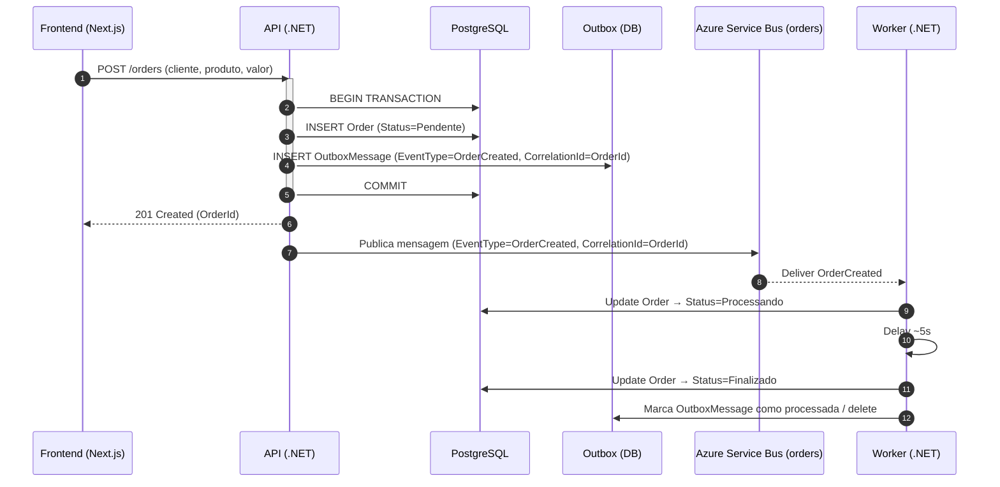

# Order-Service

Sistema simples de gestão de pedidos com **API .NET**, **Frontend React/Next**, **PostgreSQL** e **Azure Service Bus**.
Quando um pedido é criado, os dados são persistidos, um **evento** é publicado na fila e um **Worker** processa o pedido, avançando o status até **Finalizado**.

---

## 🧰 Stack & versões

* **Backend**: .NET SDK **9.0.109**
* **Frontend**: Next.js **^16.0.1**, React **^19**
* **Banco**: PostgreSQL 16 (Docker)
* **Mensageria**: Azure Service Bus — fila **`orders`**
* **Infra**: Docker / Docker Compose
* **Migrations**: automáticas no startup (sem seed)

---

## 🚀 Como subir (1 comando)

```bash
docker compose up --build -d
```

* Frontend (UI): [http://localhost:3000/orders](http://localhost:3000/orders)
* API (Swagger): [http://localhost:5127/swagger/index.html](http://localhost:5127/swagger/index.html)
* Healthcheck: [http://localhost:5127/health](http://localhost:5127/health)
* PgAdmin: [http://localhost:5050/login?next=/](http://localhost:5050/login?next=/)

> **Observação:** hoje apenas o `docker compose up --build -d` é necessário.

---

## 🔧 Configuração (.env)

Use o arquivo **`.env.example`** como base (copie para `.env` na raiz do projeto).
As variáveis relevantes incluem, entre outras, a string de conexão do Postgres e as credenciais do Service Bus.

* **Service Bus**

  * `ASB_CONNECTION`
  * `ASB_ENTITY=orders`
  * Propriedades do evento: `EventType=OrderCreated` e **⚠️ CorrelationId = OrderId (revisar se está 100% aplicado em todos os pontos).**

* **Frontend → API**
  Se desejar apontar o Frontend para outra URL de API, defina **`NEXT_PUBLIC_API_URL`** (ex.: `http://localhost:5127`).
  Caso não informe, o frontend utiliza a configuração padrão do projeto.

---

## 🧭 Endpoints principais (API)

* `POST /orders` → Cria um novo pedido
* `GET  /orders` → Lista todos os pedidos
* `GET  /orders/{id}` → Detalhes de um pedido

### Health

* `GET /health` → checa API, DB e fila

---

## 🖥️ Frontend (Rotas)

* **Lista de pedidos**: `http://localhost:3000/orders`
* **Detalhes do pedido**: `http://localhost:3000/orders/{orderId}/details`

Feedback visual:

* **Toasts** em mudanças de status
* **Polling** a cada ~3s para refletir atualizações

---

## 📦 Outbox & Mensageria (transacional)

* **Tabela**: `outbox_messages`
  Campos relevantes: `Id`, `Type`, `Payload`, `OccurredOn`, `Processed` (bool), `ProcessedOn`, `Error` (opcional).
* **Transação única**: o **pedido** e a **mensagem de outbox** são gravados na **mesma transação**.
* **Publicação**: um dispatcher lê `outbox_messages` não processadas e publica na fila **`orders`**.
* **Idempotência**: o consumidor garante consistência usando chaves (ex.: `OrderId`) e controle de mensagens processadas.
* **Delete/clean-up**: o Worker marca como processado e realiza o delete (ou soft-delete) após confirmação de envio.

---

## 🤖 Worker (consumidor)

Fluxo ao consumir `OrderCreated`:

1. Atualiza o status do pedido para **Processando**
2. Aguarda ~5 segundos
3. Atualiza o status para **Finalizado**

Propriedades do evento:

* `EventType=OrderCreated`
* **⚠️ `CorrelationId = OrderId`** (deve estar presente e propagado)

---

## 🗺️ Diagramas (Mermaid)

### Sequência (criação do pedido → processamento)



### Implantação (Docker Compose)

```mermaid
graph LR
    subgraph Docker
      FE[frontend (3000)] --- API[api (.NET, 5127)]
      API --- DB[(postgres 5432)]
      API --- ASB[(azure service bus)]
      WK[worker (.NET)] --- DB
      WK --- ASB
      PG[pgadmin (5050)] --- DB
    end
```

---

## 🧪 Testes

* **Backend**: `dotnet test backend/OrderService.sln`
* **Cobertura** (opcional):

  ```bash
  dotnet test backend/OrderService.sln --collect:"XPlat Code Coverage"
  ```
* Alguns testes que dependem do Service Bus podem ser condicionais à presença das variáveis de ambiente.

---

## 🧩 Troubleshooting

* **API não sobe / falha de conexão**: verifique `DEFAULT_CONNECTION` no `.env`.
* **Mensageria**: confirme `ASB_CONNECTION` e se a fila **`orders`** existe.
* **Migrations**: são aplicadas automaticamente no startup (ver logs da API).
* **Frontend não encontra API**: defina `NEXT_PUBLIC_API_URL` apontando para `http://localhost:5127` e reinicie o frontend.

---

## ✅ Checklist de entrega

* [x] API com `POST/GET/GET {id}`
* [x] Outbox Pattern transacional
* [x] Worker consumindo fila e atualizando status
* [x] Healthchecks (API, DB, fila)
* [x] Frontend com listagem, detalhes, criação, toasts, polling
* [x] Docker Compose (API, Worker, Frontend, Postgres, PgAdmin)
* [x] `.env.example` incluído

> **Pontos de atenção**: confirmar a presença/propagação de **`CorrelationId = OrderId`** em toda a cadeia (**⚠️**).
