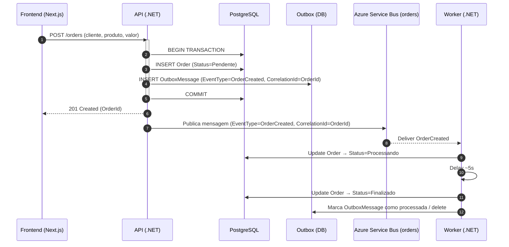
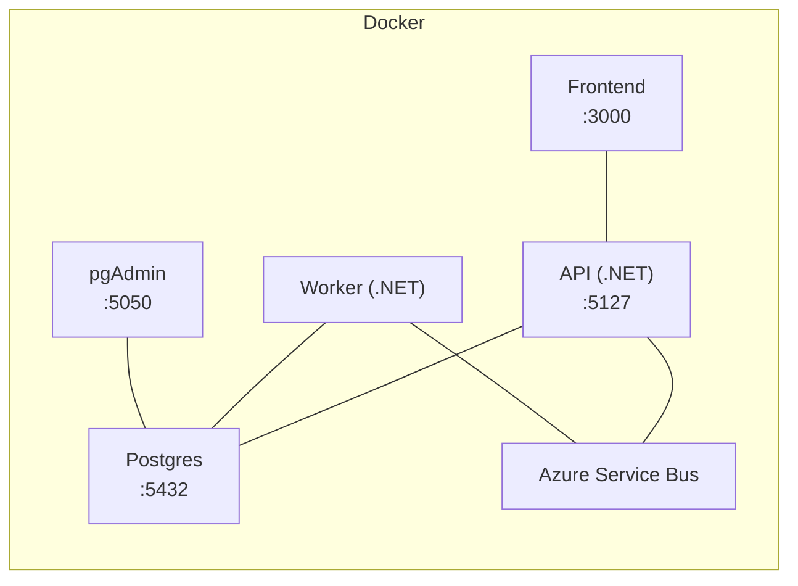

# Order-Service

Sistema simples de gestão de pedidos com **API .NET**, **Frontend React/Next**, **PostgreSQL** e **Azure Service Bus**.
Quando um pedido é criado, os dados são persistidos, um **evento** é publicado na fila e um **Worker** processa o pedido, avançando o status até **Finalizado**.

> Principais pontos
>
> * Status sequenciais obrigatórios: **Pendente → Processando → Finalizado**
> * Idempotência no consumidor
> * **CorrelationId = OrderId** e `EventType = OrderCreated` implementados e propagados
> * Outbox Pattern para mensageria transacional
> * Health checks para API, DB e fila
> * Tracing ponta-a-ponta habilitado
> * **Atualização em tempo real via SignalR** (criação de pedidos e mudança de status)
> * **Testes de integração com Testcontainers + Golden Tests**

---

## Table of Contents

* [Stack e versões](#stack)
* [Subindo tudo (1 comando)](#up)
* [Configuração (.env)](#env)

  * [Backend: API, Worker, Banco, Service Bus e PgAdmin](#env-backend)
  * [Frontend](#env-frontend)
  * [Ambiente de testes (.env.test)](#env-test)
* [Endpoints principais (API)](#api)

  * [Health](#health)
* [Frontend](#fe)
* [Notificações em tempo real (SignalR)](#realtime)
* [Outbox e Mensageria (transacional)](#outbox)
* [Worker (consumidor)](#worker)
* [Testes](#tests)
* [Diagramas](#diagrams)

  * [Sequência (criação do pedido → processamento)](#seq)
  * [Implantação (Docker Compose)](#deploy)
* [Troubleshooting](#troubleshooting)
* [Módulo opcional — IA/Analytics (escopo)](#ai)
* [Diferenciais Técnicos (bônus)](#bonuses)
* [Checklist de entrega](#checklist)
* [Entrega esperada (repositório)](#entrega)

---

<a id="stack"></a>

## Stack e versões

* **Backend**: .NET SDK **9.0.109**  (ASP.NET Core + SignalR)
* **Frontend**: Next.js **^16.0.1**, React **^19**
* **Banco**: PostgreSQL 16 (Docker)
* **Mensageria**: Azure Service Bus — fila **`orders`**
* **Comunicação em tempo real**: ASP.NET Core SignalR (WebSockets com fallback)
* **Infra**: Docker / Docker Compose
* **Migrations**: automáticas no startup (sem seed)
* **Testes de integração**: Testcontainers + Golden Tests

---

<a id="up"></a>

## Subindo tudo (1 comando)

```bash
docker compose up --build -d
```

* **Frontend (UI):** [http://localhost:3000/orders](http://localhost:3000/orders)
* **API (Swagger):** [http://localhost:5127/swagger/index.html](http://localhost:5127/swagger/index.html)
* **Healthcheck:** [http://localhost:5127/health](http://localhost:5127/health)
* **PgAdmin:** [http://localhost:5050/login?next=/](http://localhost:5050/login?next=/)

> Apenas `docker compose up --build -d` é necessário para subir todo o ambiente.

---

<a id="env"></a>

## Configuração (.env)

Use o arquivo `.env.example` como base (copie para `.env` na raiz do projeto).

<a id="env-backend"></a>

### Backend/API, Worker, Banco, Service Bus e PgAdmin

```env
# Ambiente ASP.NET
ASPNETCORE_ENVIRONMENT=Development
API_PORT=5127

# ---------- Postgres ----------
POSTGRES_DB=orders_db
POSTGRES_USER=postgres
POSTGRES_PASSWORD=postgres
POSTGRES_PORT=5432

# String de conexão usada pela aplicação (.NET)
STRING_CONNECTION=Host=db;Port=5432;Database=orders_db;Username=postgres;Password=postgres

# ---------- Azure Service Bus ----------
ASB_CONNECTION=sb://<SEU-NAMESPACE>.servicebus.windows.net/;SharedAccessKeyName=<SAS-NAME>;SharedAccessKey=<SAS-KEY>
ASB_ENTITY=orders

# ---------- PgAdmin (infra/local tooling) ----------
PGADMIN_EMAIL=admin@example.com
PGADMIN_PASSWORD=admin123
PGADMIN_PORT=5050
```

<a id="env-frontend"></a>

### Frontend

```env
# URL da API consumida pelo Frontend
NEXT_PUBLIC_API_URL=http://localhost:5127
```

Observações:

* O evento publicado inclui `EventType=OrderCreated` e **`CorrelationId=OrderId`** em toda a cadeia (API → ASB → Worker).
* O host do Postgres no Docker Compose é `db` (vide `STRING_CONNECTION`).

---

<a id="env-test"></a>

### Ambiente de testes (.env.test + Testcontainers)

Os **testes de integração** usam **Testcontainers** e um arquivo de configuração separado:

* Caminho: `backend/tests/Order.IntegrationTests/.env.test.example`
* Antes de rodar os testes, copie o exemplo:

```bash
cd backend/tests/Order.IntegrationTests
cp .env.test.example .env.test
```

Conteúdo básico do `.env.test`:

```env
# Ambiente de testes
ASPNETCORE_ENVIRONMENT=Test

# Banco de testes (repara no nome diferente)
POSTGRES_DB=orders_db_tests
POSTGRES_USER=postgres
POSTGRES_PASSWORD=postgres
POSTGRES_PORT=5432

# Connection string usada pelos testes (Host=db pois Testcontainers usa alias "db")
STRING_CONNECTION=Host=db;Port=5432;Database=orders_db_tests;Username=postgres;Password=postgres

# Service Bus fake ou separado só para teste
ASB_ENTITY=orders
ASB_CONNECTION=Endpoint=sb://<SEU-NAMESPACE>.servicebus.windows.net/;SharedAccessKeyName=<SAS-NAME>;SharedAccessKey=<SAS-KEY>

# URL do hub para cenários de teste que exercitam SignalR
ORDER_HUB_URL=http://orders-api:8080/hub/notification
```

> O `.env.test` é usado apenas pelos projetos de integração (`Order.IntegrationTests`), isolando **banco de dados**, **Service Bus** e **URL do hub** específicos de teste, sem impactar o ambiente de desenvolvimento.

---

<a id="api"></a>

## Endpoints principais (API)

* `POST /orders` → Cria um novo pedido
* `GET  /orders` → Lista todos os pedidos
* `GET  /orders/{id}` → Detalhes de um pedido

<a id="health"></a>

### Health

* `GET /health` → verifica API, DB e fila

Atributos do pedido: `id`, `cliente`, `produto`, `valor`, `status`, `data_criacao`
Regras de negócio: persistir no Postgres; publicar no ASB; status na sequência **Pendente → Processando → Finalizado**.

---

<a id="fe"></a>

## Frontend

Rotas principais:

* **Lista de pedidos:** `http://localhost:3000/orders`
* **Detalhes do pedido:** `http://localhost:3000/orders/{orderId}/details`

Feedback visual:

* Toasts em mudanças de status
* **Atualização em tempo real via SignalR**:

  * Notificação de **novo pedido criado**
  * Notificação de **mudança de status** (Pendente → Processando → Finalizado)
* Polling apenas como fallback/ponto específico (detalhes ou cenários sem WebSockets, se necessário)

> Opcionalmente, ajuste `NEXT_PUBLIC_API_URL` para apontar a API em outra URL.

---

<a id="realtime"></a>

## Notificações em tempo real (SignalR)

Além do fluxo assíncrono via Azure Service Bus, o projeto expõe um **Hub SignalR** para notificar o frontend em tempo real:

* `OrderNotificationHub` (API .NET) expõe métodos para notificar:

  * **OrderCreatedNotification** → dispara quando um novo pedido é criado
  * **OrderChangeStatusNotification** → dispara quando o Worker avança o status do pedido
* O frontend (Next.js) mantém uma conexão com o Hub usando **@microsoft/signalr**:

  * Na tela de lista (`/orders`), o hook `useOrderHub`:

    * Adiciona pedidos novos na tabela assim que são criados
    * Atualiza o `status` dos pedidos no cache do SWR ao receber eventos de mudança de status
* Com isso, a tabela de pedidos é atualizada em tempo real, sem necessidade de polling contínuo na API.

---

<a id="outbox"></a>

## Outbox e Mensageria (transacional)

* **Tabela**: `outbox_messages`
  Campos: `Id`, `Type`, `Payload`, `OccurredOn`, `Processed` (bool), `ProcessedOn`, `Error` (opcional)

* **Transação única**: **pedido** + **mensagem de outbox** gravados na **mesma transação**.

* **Dispatcher**: Publicação no Azure Service Bus: o **publicador de outbox** é o `ServiceBusOutboxPublisher`.

* **Idempotência**: consumidor usa chaves (`OrderId`) e controle de mensagens já processadas.

* **Limpeza**: após confirmação, marca como processada e realiza delete/soft-delete.

Propriedades do evento:

* `EventType = OrderCreated`
* **`CorrelationId = OrderId`** (implementado e propagado)

---

<a id="worker"></a>

## Worker (consumidor)

Fluxo ao consumir `OrderCreated`:

1. Atualiza o status do pedido para **Processando**
2. Aguarda ~5 segundos
3. Atualiza o status para **Finalizado**

O consumidor é idempotente e segue a sequência de status obrigatória.

---

<a id="tests"></a>

## Testes

### Backend (unit + integração)

Para rodar todos os testes (projetos de domínio + integração com Testcontainers):

```bash
dotnet test backend/OrderService.sln
```

### Estrutura de testes de integração

Os testes de integração ficam em:

```text
backend/tests/Order.IntegrationTests
  ├─ Fixtures/          # Builders, helpers, configurações de Testcontainers
  ├─ Golden/            # Golden files (respostas esperadas)
  ├─ Health/            # Cenários de healthcheck
  ├─ Orders/            # Cenários de criação/listagem/fluxo de pedidos
  ├─ .env.test.example  # Template de configuração para o ambiente de testes
  └─ .env.test          # Arquivo usado localmente pelos testes (não versionado)
```

Os **Golden Tests** comparam as respostas reais da API com arquivos na pasta `Golden/`, garantindo que a contração de resposta não seja quebrada sem intenção.

Os **Testcontainers** sobem automaticamente um Postgres de teste (usando o alias `db`) e aplicam o schema necessário antes de rodar os cenários.

---

<a id="diagrams"></a>

## Diagramas

<a id="seq"></a>

### Sequência (criação do pedido → processamento)



<a id="deploy"></a>

### Implantação (Docker Compose)



---

<a id="troubleshooting"></a>

## Troubleshooting

* API não sobe → verifique `STRING_CONNECTION` no `.env`.
* Mensageria → confirme `ASB_CONNECTION` e se a fila `orders` existe.
* Migrations → aplicadas automaticamente no startup (ver logs).
* Frontend não encontra API → defina `NEXT_PUBLIC_API_URL=http://localhost:5127` e reinicie o frontend.
* Testes de integração falhando por conexão:

  * Confirme se `.env.test` existe em `backend/tests/Order.IntegrationTests`.
  * Verifique se a porta do Postgres de teste não está em conflito.
  * Verifique se o Docker está rodando (Testcontainers depende disso).

---

<a id="ai"></a>

## Módulo opcional — IA/Analytics (escopo)

Endpoint/tela para perguntas em linguagem natural sobre os pedidos (ex.: “Pedidos hoje?”, “Tempo médio?”, “Pendentes agora?”, “Valor total finalizado no mês”).
A LLM interpreta a pergunta, consulta o banco e responde com dados reais.

> Este módulo é opcional e pode render pontos extras.

---

<a id="bonuses"></a>

## Diferenciais Técnicos (bônus)

* Outbox Pattern (mensageria transacional)
* Histórico de status do pedido
* Tracing ponta-a-ponta
* SignalR/WebSockets com fallback
* Testcontainers (integração)
* Golden Tests (contrato da API)
* Módulo IA/Analytics com LLM

Os itens acima (exceto o módulo de IA/Analytics) já estão implementados neste projeto.

---

<a id="checklist"></a>

## Checklist de entrega

* [x] API com `POST /orders`, `GET /orders`, `GET /orders/{id}`
* [x] Persistência (PostgreSQL) + EF Migrations automáticas
* [x] Publicação no Azure Service Bus ao criar pedido
* [x] **CorrelationId = OrderId** e `EventType = OrderCreated` implementados
* [x] Outbox Pattern transacional
* [x] Worker idempotente: Processando → Finalizado (delay ~5s)
* [x] Healthchecks (API, DB, fila)
* [x] Frontend: listagem, criação, detalhes, toasts e polling
* [x] Docker Compose (API, Worker, Frontend, Postgres, PgAdmin)
* [x] `.env.example` incluído
* [x] Tracing ponta-a-ponta habilitado
* [x] Histórico de status do pedido
* [x] SignalR/WebSockets com fallback
* [x] Testcontainers
* [x] Golden Tests
* [ ] Módulo IA/Analytics com LLM (pergunte sobre os pedidos)

---

<a id="entrega"></a>

## Entrega esperada (repositório)

* Código-fonte completo
* README.md (este arquivo) com instruções claras
* `.env.example`
* `.env.test.example` para testes de integração
* Diagramas simples de arquitetura (incluídos acima)
