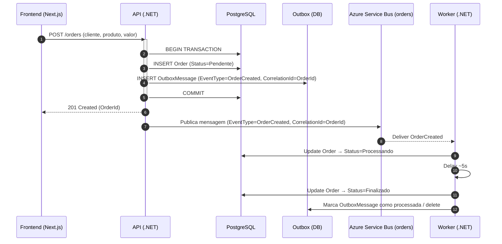
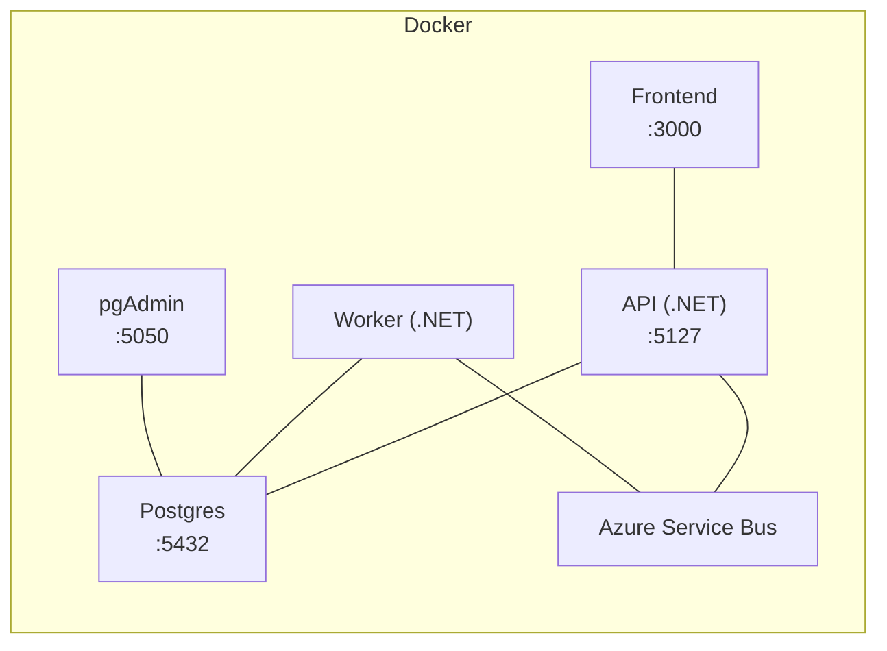

# Order-Service

Sistema simples de gestão de pedidos com **API .NET**, **Frontend React/Next**, **PostgreSQL** e **Azure Service Bus**.  
Quando um pedido é criado, os dados são persistidos, um **evento** é publicado na fila e um **Worker** processa o pedido, avançando o status até **Finalizado**.

> **Principais pontos**
> - Status sequenciais obrigatórios: **Pendente → Processando → Finalizado**
> - **Idempotência** no consumidor
> - **CorrelationId = OrderId** e `EventType = OrderCreated` **implementados e propagados**
> - **Outbox Pattern** para mensageria transacional
> - **Health checks** para API, DB e fila
> - **Tracing ponta-a-ponta** habilitado

---

##  Table of Contents

- [ Stack & versões](#stack)
- [ Subindo tudo (1 comando)](#up)
- [ Configuração (.env)](#env)
  - [Backend/API e Worker](#env-backend)
  - [Frontend](#env-frontend)
- [ Endpoints principais (API)](#api)
  - [Health](#health)
- [ Frontend](#fe)
- [ Outbox & Mensageria (transacional)](#outbox)
- [ Worker (consumidor)](#worker)
- [ Testes](#tests)
- [ Diagramas](#diagrams)
  - [Sequência (criação do pedido → processamento)](#seq)
  - [Implantação (Docker Compose)](#deploy)
- [ Troubleshooting](#troubleshooting)
- [ Módulo opcional — IA/Analytics (escopo)](#ai)
- [ Diferenciais Técnicos (bônus)](#bonuses)
- [ Checklist de entrega](#checklist)
- [ Entrega esperada (repositório)](#entrega)

---

<a id="stack"></a>
## Stack & versões

- **Backend**: .NET SDK **9.0.109**
- **Frontend**: Next.js **^16.0.1**, React **^19**
- **Banco**: PostgreSQL 16 (Docker)
- **Mensageria**: Azure Service Bus — fila **`orders`**
- **Infra**: Docker / Docker Compose
- **Migrations**: automáticas no startup (sem seed)

---

<a id="up"></a>
## Subindo tudo (1 comando)

```bash
docker compose up --build -d
````

* **Frontend (UI):** [http://localhost:3000/orders](http://localhost:3000/orders)
* **API (Swagger):** [http://localhost:5127/swagger/index.html](http://localhost:5127/swagger/index.html)
* **Healthcheck:** [http://localhost:5127/health](http://localhost:5127/health)
* **PgAdmin:** [http://localhost:5050/login?next=/](http://localhost:5050/login?next=/)

> Apenas `docker compose up --build -d` é necessário para subir todo o ambiente.

---

<a id="env"></a>

## Configuração (.env)

Use o arquivo **`.env.example`** como base (copie para `.env` na raiz do projeto).

<a id="env-backend"></a>

### Backend/API e Worker

```env
# Postgres
DEFAULT_CONNECTION=Host=postgres;Port=5432;Database=orders;Username=postgres;Password=postgres;

# Azure Service Bus
ASB_CONNECTION=Endpoint=sb://<namespace>.servicebus.windows.net/;SharedAccessKeyName=<key-name>;SharedAccessKey=<key>;EntityPath=orders
ASB_ENTITY=orders

# Observabilidade (opcional)
OTEL_EXPORTER_OTLP_ENDPOINT=http://otel-collector:4317
OTEL_SERVICE_NAME=order-service-api
```

<a id="env-frontend"></a>

### Frontend

```env
# URL da API consumida pelo Frontend
NEXT_PUBLIC_API_URL=http://localhost:5127
```

> **Importante:** O evento publicado inclui `EventType=OrderCreated` e **`CorrelationId=OrderId`** em toda a cadeia (API → ASB → Worker).

---

<a id="api"></a>

## Endpoints principais (API)

* `POST /orders` → Cria um novo pedido
* `GET  /orders` → Lista todos os pedidos
* `GET  /orders/{id}` → Detalhes de um pedido

<a id="health"></a>

### Health

* `GET /health` → verifica API, DB e fila

**Atributos do pedido:** `id`, `cliente`, `produto`, `valor`, `status`, `data_criacao`
**Regras de negócio:** persistir no Postgres; publicar no ASB; status na sequência **Pendente → Processando → Finalizado**.

---

<a id="fe"></a>

## Frontend

Rotas principais:

* **Lista de pedidos:** `http://localhost:3000/orders`
* **Detalhes do pedido:** `http://localhost:3000/orders/{orderId}/details`

Feedback visual:

* **Toasts** em mudanças de status
* **Polling** (~3s) para refletir atualizações

> Opcionalmente, configure `NEXT_PUBLIC_API_URL` para apontar a API em outra URL.

---

<a id="outbox"></a>

## Outbox & Mensageria (transacional)

* **Tabela**: `outbox_messages`
  Campos: `Id`, `Type`, `Payload`, `OccurredOn`, `Processed` (bool), `ProcessedOn`, `Error` (opcional)

* **Transação única**: **pedido** + **mensagem de outbox** são gravados na **mesma transação**.

* **Dispatcher**: publica mensagens não processadas na fila **`orders`** do Azure Service Bus.

* **Idempotência**: consumidor usa chaves (`OrderId`) e controle de mensagens já processadas.

* **Limpeza**: após confirmação, marca como processada e realiza delete/soft-delete.

**Propriedades do evento**

* `EventType = OrderCreated`
* **`CorrelationId = OrderId`** (implementado e propagado)

---

<a id="worker"></a>

## Worker (consumidor)

Fluxo ao consumir `OrderCreated`:

1. Atualiza o status do pedido para **Processando**
2. Aguarda ~5 segundos
3. Atualiza o status para **Finalizado**

O consumidor é **idempotente** e segue a sequência de status obrigatória.

---

<a id="tests"></a>

## Testes

### Backend

```bash
dotnet test backend/OrderService.sln
```

**Cobertura** (opcional):

```bash
dotnet test backend/OrderService.sln --collect:"XPlat Code Coverage"
```

> Testes que dependem do Service Bus podem ser condicionais às variáveis de ambiente.

---

<a id="diagrams"></a>

## 🗺️ Diagramas

<a id="seq"></a>

### Sequência (criação do pedido → processamento)



<a id="deploy"></a>

### Implantação (Docker Compose)



---

<a id="troubleshooting"></a>

## Troubleshooting

* **API não sobe** → verifique `DEFAULT_CONNECTION` no `.env`.
* **Mensageria** → confirme `ASB_CONNECTION` e se a fila **`orders`** existe.
* **Migrations** → aplicadas automaticamente no startup (ver logs).
* **Frontend não encontra API** → defina `NEXT_PUBLIC_API_URL=http://localhost:5127` e reinicie o frontend.

---

<a id="ai"></a>

## Módulo opcional — IA/Analytics (escopo)

Endpoint/tela para perguntas em linguagem natural sobre os pedidos (ex.: “Pedidos hoje?”, “Tempo médio?”, “Pendentes agora?”, “Valor total finalizado no mês”).
A LLM interpreta a pergunta, consulta o banco e responde com dados reais.

> Este módulo é **opcional** e pode render pontos extras.

---

<a id="bonuses"></a>

## Diferenciais Técnicos (bônus)

* **Outbox Pattern (mensageria transacional)**
* **Histórico de status do pedido**
* **Tracing ponta-a-ponta**
* SignalR/WebSockets com fallback
* Testcontainers
* Golden Tests
* Módulo IA/Analytics com LLM

> Os três primeiros já estão contemplados neste projeto; os demais podem ser evoluídos.

---

<a id="checklist"></a>

## Checklist de entrega

* [x] API com `POST /orders`, `GET /orders`, `GET /orders/{id}`
* [x] Persistência (PostgreSQL) + EF Migrations automáticas
* [x] Publicação no Azure Service Bus ao criar pedido
* [x] **CorrelationId = OrderId** e `EventType = OrderCreated` **implementados**
* [x] **Outbox Pattern** transacional
* [x] Worker idempotente: Processando → Finalizado (delay ~5s)
* [x] Healthchecks (API, DB, fila)
* [x] Frontend: listagem, criação, detalhes, toasts e polling
* [x] Docker Compose (API, Worker, Frontend, Postgres, PgAdmin)
* [x] `.env.example` incluído
* [x] **Tracing ponta-a-ponta** habilitado
* [x] Histórico de status do pedido
* [ ] SignalR/WebSockets com fallback
* [ ] Testcontainers
* [ ] Golden Tests
* [ ] Módulo IA/Analytics com LLM (pergunte sobre os pedidos)

---

<a id="entrega"></a>

## Entrega esperada (repositório)

* Código-fonte completo
* **README.md** (este arquivo) com instruções claras
* **`.env.example`**
* **Diagramas simples de arquitetura** (incluídos acima)

---

