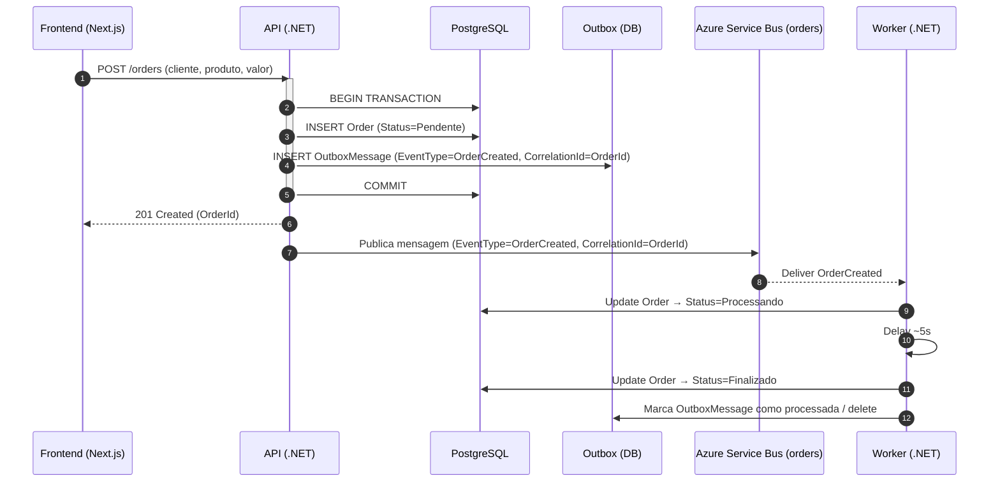
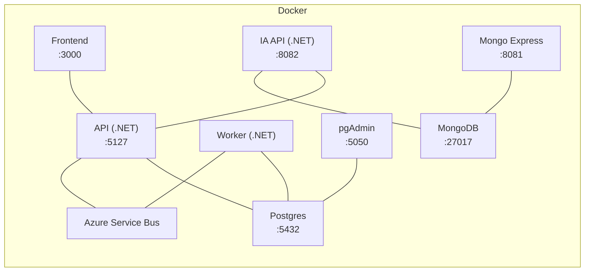

# Order-Service

Sistema simples de gestão de pedidos com **API .NET**, **Frontend React/Next**, **PostgreSQL**, **Azure Service Bus** e um módulo de **IA/Analytics** que responde perguntas em linguagem natural sobre os pedidos.

Quando um pedido é criado, os dados são persistidos, um **evento** é publicado na fila e um **Worker** processa o pedido, avançando o status até **Finalizado**.  
O módulo de IA gera SQL a partir da pergunta do usuário, executa na API e grava o histórico (pergunta, resposta, modelo e tokens) em um **MongoDB**.

> Principais pontos
>
> * Status sequenciais obrigatórios: **Pendente → Processando → Finalizado**
> * Idempotência no consumidor
> * **CorrelationId = OrderId** e `EventType = OrderCreated` implementados e propagados
> * Outbox Pattern para mensageria transacional
> * Health checks para API, DB e fila
> * Tracing ponta-a-ponta habilitado
> * **Atualização em tempo real via SignalR** (criação de pedidos e mudança de status)
> * **Testes de integração com Testcontainers + Golden Tests**
> * **Módulo IA/Analytics**:
>   * Gera SQL via LLM a partir da pergunta do usuário
>   * Executa o SQL via endpoint interno da API
>   * Responde em linguagem natural
>   * Salva histórico em MongoDB com **modelo usado** e **quantidade de tokens**

---

## Table of Contents

* [Stack e versões](#stack)
* [Subindo tudo (1 comando)](#up)
* [Configuração (.env)](#env)
  * [Backend: API, Worker, Banco, Service Bus e PgAdmin](#env-backend)
  * [IA / MongoDB / OpenAI](#env-ia)
  * [Frontend](#env-frontend)
  * [Ambiente de testes (.env.test)](#env-test)
* [Endpoints principais (API)](#api)
  * [Health](#health)
* [Frontend](#fe)
* [Notificações em tempo real (SignalR)](#realtime)
* [Outbox e Mensageria (transacional)](#outbox)
* [Worker (consumidor)](#worker)
* [Módulo IA/Analytics](#ai)
  * [Arquitetura IA](#ai-arch)
  * [Endpoints IA](#ai-endpoints)
  * [Histórico em MongoDB](#ai-history)
* [Testes](#tests)
* [Diagramas](#diagrams)
  * [Sequência (criação do pedido → processamento)](#seq)
  * [Implantação (Docker Compose)](#deploy)
* [Troubleshooting](#troubleshooting)
* [Diferenciais Técnicos (bônus)](#bonuses)
* [Checklist de entrega](#checklist)
* [Entrega esperada (repositório)](#entrega)

---

<a id="stack"></a>

## Stack e versões

* **Backend**: .NET SDK **9.0.109** (ASP.NET Core + Minimal APIs + SignalR)
* **Frontend**: Next.js **^16.0.1**, React **^19**
* **Banco relacional**: PostgreSQL 16 (Docker)
* **Mensageria**: Azure Service Bus — fila **`orders`**
* **Comunicação em tempo real**: ASP.NET Core SignalR (WebSockets com fallback)
* **Banco NoSQL (IA)**: MongoDB 6 + Mongo Express (admin web)
* **LLM / IA**: OpenAI Chat API (`gpt-4o-mini`)
* **Infra**: Docker / Docker Compose
* **Migrations**: automáticas no startup (sem seed)
* **Testes de integração**: Testcontainers + Golden Tests

---

<a id="up"></a>

## Subindo tudo (1 comando)

```bash
docker compose up --build -d
````

Serviços principais:

* **Frontend (UI):** `http://localhost:3000/orders`

  * Tela de IA: `http://localhost:3000/ia`
* **API de Pedidos (Swagger):** `http://localhost:5127/swagger/index.html`
* **Healthcheck da API:** `http://localhost:5127/health`
* **PgAdmin:** `http://localhost:5050`
* **Mongo Express (IA / histórico):** `http://localhost:8081`
* **API de IA (Swagger / endpoints):** `http://localhost:8082/swagger` (porta configurável via `.env`)

> Apenas `docker compose up --build -d` é necessário para subir todo o ambiente (API, Worker, Frontend, Postgres, PgAdmin, MongoDB, Mongo Express e IA API).

---

<a id="env"></a>

## Configuração (.env)

Use o arquivo `.env.example` como base (copie para `.env` na raiz do projeto).

```bash
cp .env.example .env
```

Ajuste os valores conforme sua máquina/ambiente.

---

<a id="env-backend"></a>

### Backend/API, Worker, Banco, Service Bus e PgAdmin

```env
# Ambiente ASP.NET
ASPNETCORE_ENVIRONMENT=Development
API_PORT=5127

# ---------- Postgres ----------
POSTGRES_DB=orders_db
POSTGRES_USER=postgres
POSTGRES_PASSWORD=postgres
POSTGRES_PORT=5432

# String de conexão usada pela aplicação (.NET)
STRING_CONNECTION=Host=db;Port=5432;Database=orders_db;Username=postgres;Password=postgres

# ---------- Azure Service Bus ----------
ASB_CONNECTION=sb://<SEU-NAMESPACE>.servicebus.windows.net/;SharedAccessKeyName=<SAS-NAME>;SharedAccessKey=<SAS-KEY>
ASB_ENTITY=orders

# ---------- PgAdmin (infra/local tooling) ----------
PGADMIN_EMAIL=admin@example.com
PGADMIN_PASSWORD=admin123
PGADMIN_PORT=5050
```

Observações:

* O host do Postgres dentro da rede Docker é `db` (vide `STRING_CONNECTION`).
* O evento publicado inclui `EventType=OrderCreated` e **`CorrelationId=OrderId`** na cadeia (API → ASB → Worker).

---

<a id="env-ia"></a>

### IA / MongoDB / OpenAI

```env
# ---------- MongoDB (IA / histórico) ----------
MONGO_CONNECTION=mongodb://mongo:27017
MONGO_DB=orderIa

# ---------- OpenAI ----------
# Chave de API usada pelo Order.Ia.Api
OPENAI_API_KEY=sk-...

# Porta exposta da API de IA (host)
IA_API_PORT=8082
```

* O container do **MongoDB** é acessado internamente via host `mongo` na porta `27017`.
* O histórico da IA é persistido no banco `orderIa`, coleção `history`.
* A API de IA lê `MONGO_CONNECTION` e `MONGO_DB` via `IConfiguration` e usa `OpenAIClient` com `OPENAI_API_KEY`.

---

<a id="env-frontend"></a>

### Frontend

```env
# URL da API de pedidos consumida pelo Frontend
NEXT_PUBLIC_API_URL=http://localhost:5127

# (Opcional) se a IA tiver uma URL diferente da API de pedidos:
NEXT_PUBLIC_IA_API_URL=http://localhost:8082
```

> A tela `/ia` do frontend usa o endpoint da IA API para enviar perguntas e exibir a resposta.

---

<a id="env-test"></a>

### Ambiente de testes (.env.test + Testcontainers)

Os **testes de integração** usam **Testcontainers** e um arquivo de configuração separado:

* Caminho: `backend/tests/Order.IntegrationTests/.env.test.example`
* Antes de rodar os testes, copie o exemplo:

```bash
cd backend/tests/Order.IntegrationTests
cp .env.test.example .env.test
```

Conteúdo básico do `.env.test`:

```env
# Ambiente de testes
ASPNETCORE_ENVIRONMENT=Test

# Banco de testes
POSTGRES_DB=orders_db_tests
POSTGRES_USER=postgres
POSTGRES_PASSWORD=postgres
POSTGRES_PORT=5432

# Connection string usada pelos testes (Host=db pois Testcontainers usa alias "db")
STRING_CONNECTION=Host=db;Port=5432;Database=orders_db_tests;Username=postgres;Password=postgres

# Service Bus fake ou separado só para teste
ASB_ENTITY=orders
ASB_CONNECTION=Endpoint=sb://<SEU-NAMESPACE>.servicebus.windows.net/;SharedAccessKeyName=<SAS-NAME>;SharedAccessKey=<SAS-KEY>

# URL do hub para cenários de teste que exercitam SignalR
ORDER_HUB_URL=http://orders-api:8080/hub/notification
```

> O `.env.test` é usado apenas pelos projetos de integração (`Order.IntegrationTests`), isolando **banco de dados**, **Service Bus** e **URL do hub** específicos de teste, sem impactar o ambiente de desenvolvimento.

---

<a id="api"></a>

## Endpoints principais (API de pedidos)

* `POST /orders` → Cria um novo pedido
* `GET  /orders` → Lista todos os pedidos
* `GET  /orders/{id}` → Detalhes de um pedido
* `GET  /orders/{id}/history` → Histórico de status do pedido
* `POST /internal/sql` → Endpoint interno para execução de SQL (usado pela IA)

<a id="health"></a>

### Health

* `GET /health` → verifica API, DB e fila

Atributos do pedido: `id`, `cliente_nome`, `produto`, `valor`, `status`, `data_criacao`, `data_efetivacao`
Regras de negócio: persistir no Postgres; publicar no ASB; status na sequência **Pendente → Processando → Finalizado**.

---

<a id="fe"></a>

## Frontend

Rotas principais:

* **Lista de pedidos:** `http://localhost:3000/orders`
* **Detalhes do pedido:** `http://localhost:3000/orders/{orderId}/details`
* **Tela de IA / Analytics:** `http://localhost:3000/ia`

Features:

* Criação de pedido com formulário simples
* Lista paginada com status, valor, datas, etc.
* Toasts e feedback visual em mudanças de status
* **Atualização em tempo real via SignalR**:

  * Notificação de **novo pedido criado**
  * Notificação de **mudança de status** (Pendente → Processando → Finalizado)
* Tela de IA:

  * Campo de entrada de pergunta
  * Mostra pergunta + resposta formatada
  * Integração com IA API

---

<a id="realtime"></a>

## Notificações em tempo real (SignalR)

Além do fluxo assíncrono via Azure Service Bus, o projeto expõe um **Hub SignalR** para notificar o frontend em tempo real:

* `OrderNotificationHub` (API .NET) expõe métodos para notificar:

  * **OrderCreatedNotification** → dispara quando um novo pedido é criado
  * **OrderChangeStatusNotification** → dispara quando o Worker avança o status do pedido

* O frontend (Next.js) mantém uma conexão com o Hub usando **@microsoft/signalr**:

  * Na tela de lista (`/orders`), o hook `useOrderHub`:

    * Adiciona pedidos novos na tabela assim que são criados
    * Atualiza o `status` dos pedidos no cache do SWR ao receber eventos de mudança de status

---

<a id="outbox"></a>

## Outbox e Mensageria (transacional)

* **Tabela**: `outbox_messages`
  Campos: `Id`, `Type`, `Payload`, `OccurredOn`, `Processed` (bool), `ProcessedOn`, `Error` (opcional)

* **Transação única**: **pedido** + **mensagem de outbox** gravados na **mesma transação**.

* **Dispatcher**: publicação no Azure Service Bus via `ServiceBusOutboxPublisher`.

* **Idempotência**: consumidor usa chave de negócio (`OrderId`) e controle de mensagens já processadas.

* **Limpeza**: após confirmação, marca como processada e realiza delete/soft-delete.

Propriedades do evento:

* `EventType = OrderCreated`
* **`CorrelationId = OrderId`** (implementado e propagado)

---

<a id="worker"></a>

## Worker (consumidor)

Fluxo ao consumir `OrderCreated`:

1. Atualiza o status do pedido para **Processando**
2. Aguarda ~5 segundos
3. Atualiza o status para **Finalizado**

O consumidor é idempotente e segue a sequência de status obrigatória.

---

<a id="ai"></a>

## Módulo IA/Analytics

Tela e API para perguntas em linguagem natural sobre os pedidos, por exemplo:

* “Quais pedidos com status `Processando` existem agora?”
* “Qual o valor total de pedidos finalizados hoje?”
* “Quantos pedidos o cliente X fez este mês?”

### Fluxo geral

1. Frontend envia **pergunta em texto** para a IA API (`Order.Ia.Api`).
2. A IA API usa o **schema do banco + regras + exemplos** para gerar um **SQL seguro**.
3. A IA API chama o endpoint interno `/internal/sql` da API de pedidos, enviando o SQL gerado.
4. A API de pedidos valida o SQL (ex.: exige `LIMIT`, bloqueia comandos perigosos) e executa no Postgres.
5. A IA API recebe o JSON bruto, gera uma **resposta em português** para o usuário.
6. A IA API salva o histórico em MongoDB (`orderIa.history`), incluindo:

   * Pergunta do usuário
   * SQL gerado
   * Resposta final
   * **Modelo usado** (ex: `gpt-4o-mini`)
   * **Tokens usados** (soma das duas chamadas de IA)
   * `CreatedAt`

---

<a id="ai-arch"></a>

### Arquitetura IA

**Projetos principais:**

* `Order.Ia.Api` (Minimal API .NET)
* `Order.Ia.Application` (serviços de domínio da IA)
* `Order.Ia.Application.Services.IAService`

  * Usa `ChatClient` (`gpt-4o-mini`) para:

    * Gerar o SQL (`GenerateSqlAsync`)
    * Gerar a resposta final em PT-BR (`AnswerAsync`)
  * Recupera `Model` e `Usage` (tokens) do `ChatCompletion`
* `Order.Ia.Application.Services.IAHistoryService`

  * Usa `MongoClient` com `MONGO_CONNECTION` e `MONGO_DB`
  * Salva documentos na coleção `history`

**Banco IA (MongoDB):**

* **Database**: `orderIa`
* **Collection**: `history`
* Exemplo de documento:

```json
{
  "_id": "...",
  "Question": "Quando pedidos com status processando existem?",
  "Answer": "Atualmente, existe um pedido com o status \"Processando\"...",
  "Sql": "SELECT ...",
  "ModelUsed": "gpt-4o-mini",
  "TokensUsed": 142,
  "CreatedAt": "2025-11-27T01:49:38Z"
}
```

---

<a id="ai-endpoints"></a>

### Endpoints IA

Na **IA API** (`Order.Ia.Api`), expostos via Minimal API:

* `POST /ia` (ou `/ia/ask`)

  * Body: `{ "question": "texto da pergunta" }`
  * Response: `{ "answer": "texto em português para o usuário" }`
* (Opcional) `GET /ia/history`

  * Lista os últimos registros do histórico (ex.: últimos 50 documentos da collection `history`)

> A tela `/ia` do frontend chama o endpoint `POST /ia` e exibe a resposta.

---

<a id="ai-history"></a>

### Visualizando o histórico da IA (MongoDB)

* Acesse **Mongo Express** em `http://localhost:8081`
* Clique em **`orderIa`** → **`history`**
* Cada documento representa uma pergunta/resposta processada, incluindo:

  * `Question`
  * `Answer`
  * `CreatedAt`
  * `ModelUsed`
  * `TokensUsed`

---

<a id="tests"></a>

## Testes

### Backend (unit + integração)

Para rodar todos os testes (projetos de domínio + integração com Testcontainers):

```bash
dotnet test backend/OrderService.sln
```

### Estrutura de testes de integração

Os testes de integração ficam em:

```text
backend/tests/Order.IntegrationTests
  ├─ Fixtures/          # Builders, helpers, configurações de Testcontainers
  ├─ Golden/            # Golden files (respostas esperadas)
  ├─ Health/            # Cenários de healthcheck
  ├─ Orders/            # Cenários de criação/listagem/fluxo de pedidos
  ├─ .env.test.example  # Template de configuração para o ambiente de testes
  └─ .env.test          # Arquivo usado localmente pelos testes (não versionado)
```

Os **Golden Tests** comparam as respostas reais da API com arquivos na pasta `Golden/`, garantindo que o contrato de resposta não seja quebrado sem intenção.

Os **Testcontainers** sobem automaticamente um Postgres de teste (alias `db`) e aplicam o schema necessário antes de rodar os cenários.

---

<a id="diagrams"></a>

## Diagramas

<a id="seq"></a>

### Sequência (criação do pedido → processamento)


```mermaid
sequenceDiagram
    autonumber
    participant UI as Frontend (Next.js)
    participant API as API (.NET)
    participant DB as PostgreSQL
    participant OB as Outbox (DB)
    participant ASB as Azure Service Bus (orders)
    participant WK as Worker (.NET)

    UI->>API: POST /orders (cliente, produto, valor)
    activate API
    API->>DB: BEGIN TRANSACTION
    API->>DB: INSERT Order (Status=Pendente)
    API->>OB: INSERT OutboxMessage (EventType=OrderCreated, CorrelationId=OrderId)
    API->>DB: COMMIT
    deactivate API
    API-->>UI: 201 Created (OrderId)

    API->>ASB: Publica mensagem (EventType=OrderCreated, CorrelationId=OrderId)
    ASB-->>WK: Deliver OrderCreated

    WK->>DB: Update Order → Status=Processando
    WK->>WK: Delay ~5s
    WK->>DB: Update Order → Status=Finalizado
    WK->>OB: Marca OutboxMessage como processada / delete
```

<a id="deploy"></a>

### Implantação (Docker Compose)


```mermaid
graph LR
  subgraph Docker
    FE["Frontend<br/>:3000"] --- API["API (.NET)<br/>:5127"]
    API --- DB["Postgres<br/>:5432"]
    API --- ASB["Azure Service Bus"]
    WK["Worker (.NET)"] --- DB
    WK --- ASB
    PG["pgAdmin<br/>:5050"] --- DB

    IAAPI["IA API (.NET)<br/>:8082"] --- API
    IAAPI --- MG["MongoDB<br/>:27017"]
    MGE["Mongo Express<br/>:8081"] --- MG
  end
```

---

<a id="troubleshooting"></a>

## Troubleshooting

* API não sobe → verifique `STRING_CONNECTION` no `.env`.
* Mensageria → confirme `ASB_CONNECTION` e se a fila `orders` existe.
* Migrations → aplicadas automaticamente no startup (ver logs).
* Frontend não encontra API → defina `NEXT_PUBLIC_API_URL=http://localhost:5127` e reinicie o frontend.
* IA retornando erro 500:

  * Verifique logs da API de pedidos (`docker logs orders-api`) – muitas validações de SQL (`A query deve conter um LIMIT`) são intencionais.
  * Verifique se `OPENAI_API_KEY` está configurado.
  * Verifique se `MONGO_CONNECTION` / `MONGO_DB` estão corretos.
* Mongo Express vazio:

  * Confirme se você já executou pelo menos uma pergunta na tela `/ia`.
  * Verifique se o histórico está sendo salvo na collection `history` do banco `orderIa`.

---

<a id="bonuses"></a>

## Diferenciais Técnicos (bônus)

* Outbox Pattern (mensageria transacional)
* Histórico de status do pedido
* Tracing ponta-a-ponta
* SignalR/WebSockets com fallback
* Testcontainers (integração)
* Golden Tests (contrato da API)
* **Módulo IA/Analytics com LLM + MongoDB**
* Execução de SQL via endpoint interno com validações de segurança (LIMIT obrigatório, bloqueio de comandos perigosos)

---

<a id="checklist"></a>

## Checklist de entrega

* [x] API com `POST /orders`, `GET /orders`, `GET /orders/{id}`
* [x] Persistência (PostgreSQL) + EF Migrations automáticas
* [x] Publicação no Azure Service Bus ao criar pedido
* [x] **CorrelationId = OrderId** e `EventType = OrderCreated` implementados
* [x] Outbox Pattern transacional
* [x] Worker idempotente: Processando → Finalizado (delay ~5s)
* [x] Healthchecks (API, DB, fila)
* [x] Frontend: listagem, criação, detalhes, toasts e SignalR
* [x] Docker Compose (API, Worker, Frontend, Postgres, PgAdmin)
* [x] `.env.example` incluído
* [x] Tracing ponta-a-ponta habilitado
* [x] Histórico de status do pedido
* [x] SignalR/WebSockets com fallback
* [x] Testcontainers
* [x] Golden Tests
* [x] Módulo IA/Analytics com LLM + MongoDB

---

<a id="entrega"></a>

## Entrega esperada (repositório)

* Código-fonte completo
* README.md (este arquivo) com instruções claras
* `.env.example`
* `.env.test.example` para testes de integração
* Diagramas simples de arquitetura (incluídos acima)
